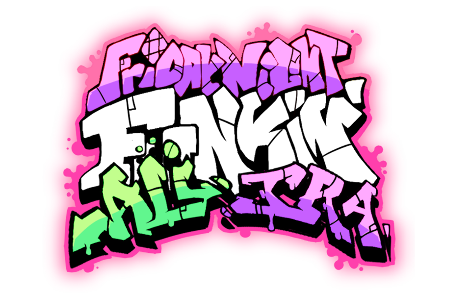
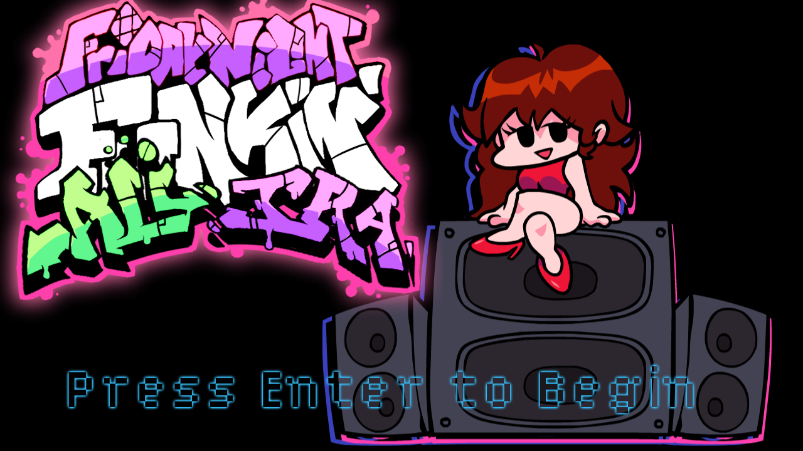
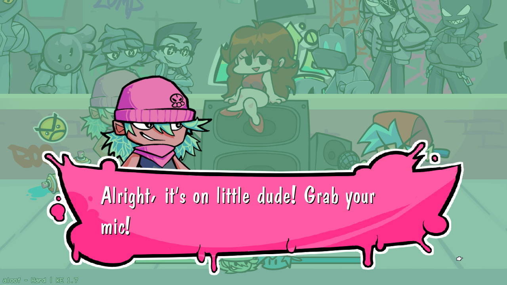
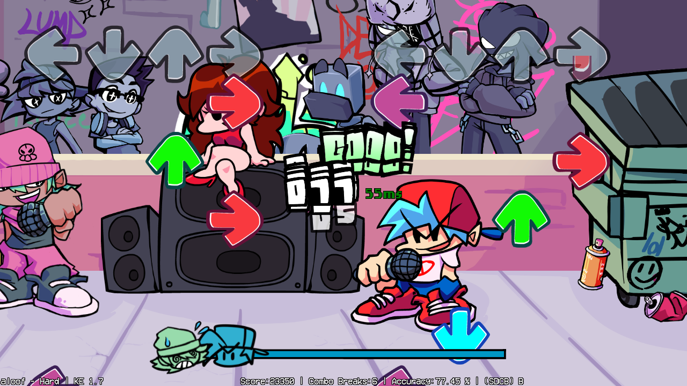
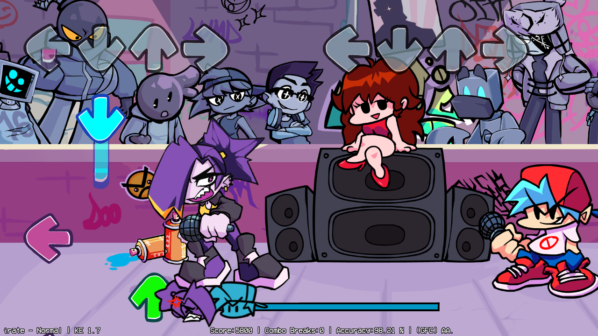
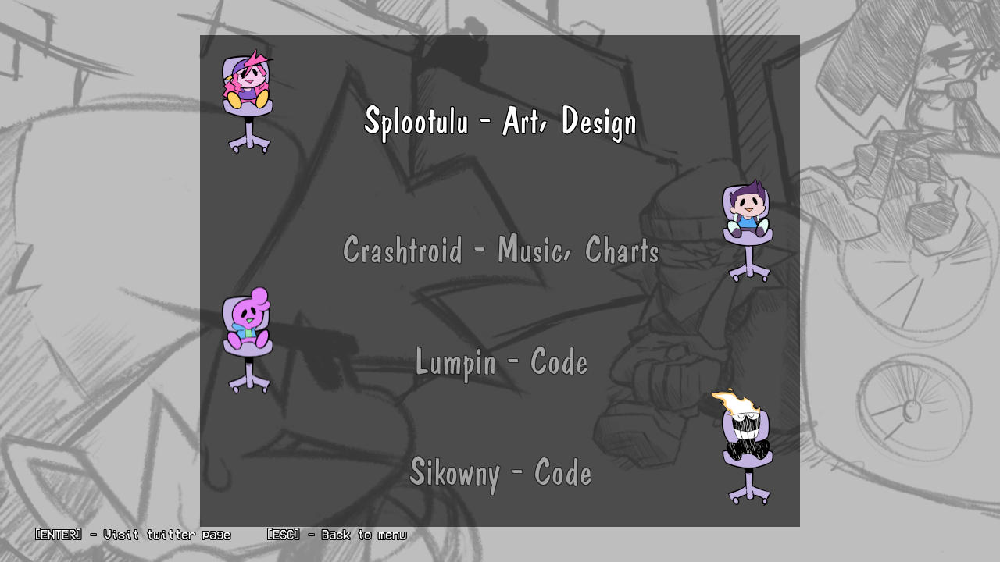

# Friday Night Funkin': Ali & Ira

## Friday Night Funkin'
**Friday Night Funkin'** is a rhythm game originally made for Ludum Dare 47 "Stuck In a Loop".

Links: **[itch.io page](https://ninja-muffin24.itch.io/funkin) ⋅ [Newgrounds](https://www.newgrounds.com/portal/view/770371) ⋅ [source code on GitHub](https://github.com/ninjamuffin99/Funkin)**
> Uh oh! Your tryin to kiss ur hot girlfriend, but her MEAN and EVIL dad is trying to KILL you! He's an ex-rockstar, the only way to get to his heart? The power of music... 

# Features

 - **2 Original Songs**
 - **Dialogue Cutscenes**
 - **Future Weeks Planned**
	- Stay tuned on our twitter for updates

# Previews

# Credits
### Mod Team
 - [Splootulu](https://twitter.com/Splootulu) - Art, Direction
 - [Crashtroid](https://twitter.com/crashtroid) - Music, Charts
 - [Lumpin](https://twitter.com/lumpman12) and [Sikowny](https://twitter.com/Sikowny) - Coding

### Friday Night Funkin'
 - [ninjamuffin99](https://twitter.com/ninja_muffin99) - Programming
 - [PhantomArcade3K](https://twitter.com/phantomarcade3k) and [Evilsk8r](https://twitter.com/evilsk8r) - Art
 - [Kawai Sprite](https://twitter.com/kawaisprite) - Music

"This game was made with love to Newgrounds and its community. Extra love to Tom Fulp."

### Kade Engine
- [KadeDeveloper](https://twitter.com/KadeDeveloper) - Maintainer and lead programmer
- [The contributors](https://github.com/KadeDev/Kade-Engine/graphs/contributors)
